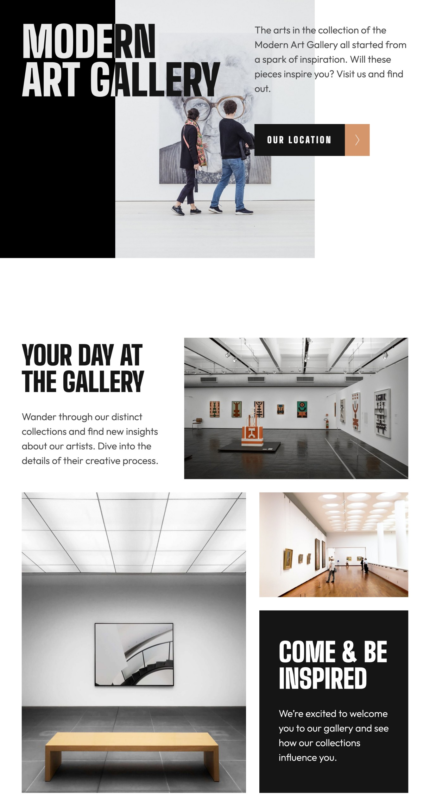
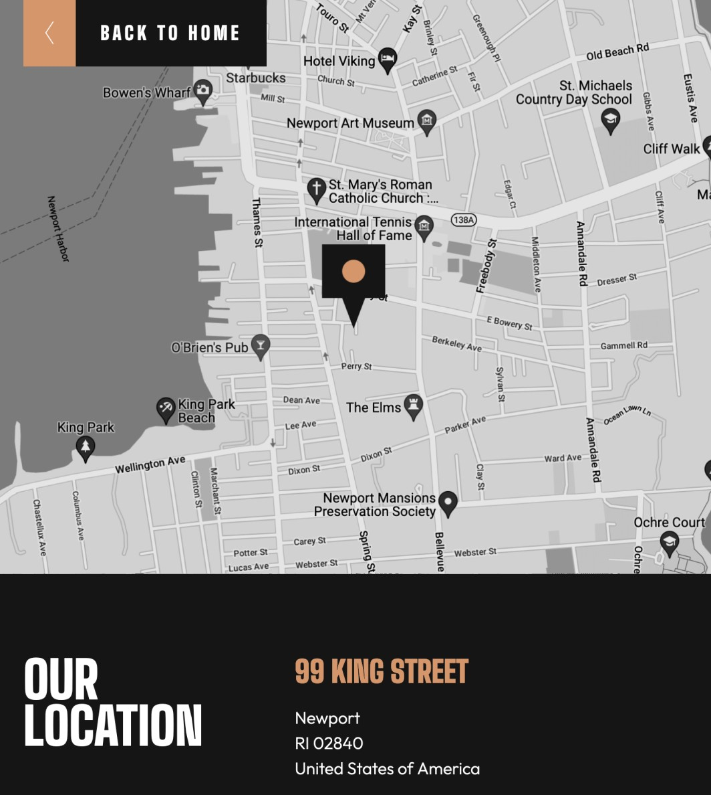

# Frontend Mentor - Art gallery website solution

This is a solution to the [Art gallery website challenge on Frontend Mentor](https://www.frontendmentor.io/challenges/art-gallery-website-yVdrZlxyA). Frontend Mentor challenges help you improve your coding skills by building realistic projects. 

## Table of contents

- [Overview](#overview)
  - [The challenge](#the-challenge)
  - [Screenshots](#screenshot)
  - [Links](#links)
- [My process](#my-process)
  - [Built with](#built-with)
  - [What I learned](#what-i-learned)
  - [Continued development](#continued-development)
- [Author](#author)

## Overview

### The challenge

Users should be able to:

- View the optimal layout for each page depending on their device's screen size
- See hover states for all interactive elements throughout the site
- **Bonus**: Use [Leaflet JS](https://leafletjs.com/) to create an interactive location map with custom location pin

### Screenshots





### Links

- [Solution URL](https://www.frontendmentor.io/solutions/responsive-twopage-site-using-css-grid-and-flexbox--vDSb8yNr)
- [live site URL](https://mattpahuta.github.io/art-gallery-website/index.html)

## My process

### Built with

- Semantic HTML5 markup
- CSS custom properties
- Flexbox
- CSS Grid
- Mobile-first workflow

### What I learned

I'd never used the mix-blend-mode property before so achieving the main heading design took a bit of researching and testing out different element color combos before I managed to get the right look.

```css
.hero .column-left {
  z-index: 1;
  background-color: var(--clr-white);
  mix-blend-mode: difference;
}
```
The link buttons were a lot of trial and error getting the positioning correct and good practice working with pseudo-elements. Thankfully the design comps made matching the dimensions achievable.

```css
.button::after {
  content: url("../assets/icon-arrow-right.svg");
  width: 3.5rem;
  height: 4.5rem;
  position: absolute;
  left: 12.75rem;
  background-color: var(--clr-gold);
  color: var(--clr-white);
  display: flex;
  justify-content: center;
  align-items: center;
  transition: inherit;
}
```

### Continued development

I wasted a fair amount of time trying to use CSS Grid for the home page header before finally realizing that Flexbox was going to be a more straightforward solution. I need to continue to get better at planning and anticipating the various layouts before chasing a method that's not working. 

The version 2 of this site will be to integrate the leaflet JavaScript library to replace the the static map image with an interactive solution. Also, need to resolve a few lingering accessibility issues.

## Author

- Frontend Mentor - [@MattPahuta](https://www.frontendmentor.io/profile/MattPahuta)
- Twitter - [@MattPahuta](https://twitter.com/MattPahuta)